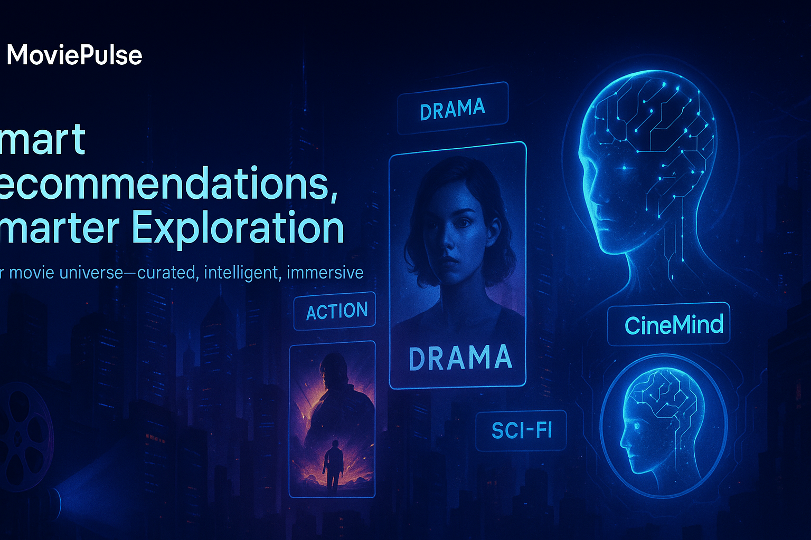

<p align="center">
  
</p>

<h1 align="center">🎬 MoviePulse</h1>
<p align="center"><em>Your movie universe — curated, intelligent, and immersive.</em></p>

<p align="center">
  <a href="https://github.com/jaymwangi/MoviePulse">
    
  </a>
  <a href="https://img.shields.io/badge/python-3.10%2B-blue?style=flat-square">
    
  </a>
  <a href="https://github.com/jaymwangi/MoviePulse/commits/main">
    
  </a>
</p>

---

## 🌟 Overview

**MoviePulse** is a smart and immersive movie recommendation platform powered by AI and built with Streamlit.  
It fuses intelligent filtering, hybrid recommenders, and a cinematic UI to help users discover, explore, and enjoy movies tailored to their tastes.

This project leverages TMDB data, NLP embeddings, explainability layers, and contextual personalization to craft a seamless and intelligent movie experience.

---

## 🚀 Key Features

- 🔍 **Search & Discover** – Instant search with intelligent suggestions  
- 🎞️ **Smart Recommendations** – Hybrid engine using embeddings, genres, and mood metadata  
- 🧠 **CineMind AI** – Explainable recommendations with contextual awareness  
- 🗂️ **Sidebar Filters** – Intuitive filters for genres, moods, ratings, release year, etc.  
- 🧑‍🤝‍🧑 **Cinephile & Date Night Modes** – Personalized flows for individuals and couples  
- 📅 **Mood Calendar & Watchlist** – Plan and save your movie lineups  
- ✨ **Immersive UI** – Dark mode, spoiler-free mode, hover animations  
- 📊 **Analytics + A/B Testing** – Track engagement and optimize recommendations  
- ♿ **Accessibility Options** – Dyslexia-friendly fonts and minimalist themes  

---

## 📁 Project Structure

<details>
<summary><strong>Click to expand full structure</strong></summary>

```plaintext
moviepulse/
├── app.py                        # Streamlit entry point
├── .env                         # Local environment secrets
├── README.md                    # Overview, setup, features
├── requirements.txt             # Python dependencies
├── .streamlit/                  
│   └── config.toml              # Theme and UI config
├── core_config/
│   ├── app_settings.py          # Global feature toggles and config
│   ├── constants.py             # Static mappings (genres, moods)
│   └── local_secrets.toml
├── media_assets/
│   ├── logos/                   # App logos and banner
│   ├── posters/                 # Cached TMDB posters
│   ├── icons/                   # SVG icons for UI
│   ├── audio/                   # Optional ambient sounds
│   └── styles/                  # Custom CSS
├── translations/               # Multilingual strings (optional)
├── streamlit_pages/
│   ├── 1_🏠_Home.py
│   ├── 2_🔍_Search.py
│   ├── 3_🎬_MovieDetails.py
│   ├── 4_⭐_Watchlist.py
│   ├── 5_🎭_ActorProfile.py
│   ├── 6_🎞️_GenreView.py
│   ├── 7_🎯_CinephileMode.py
│   ├── 8_📅_MoodCalendar.py
│   └── 9_⚙️_UserSettings.py
├── ui_components/
│   ├── HeaderBar.py
│   ├── SidebarFilters.py
│   ├── SearchInput.py
│   ├── MovieTile.py
│   ├── MovieGridView.py
│   ├── SmartTagDisplay.py
│   ├── QuickSummary.py
│   ├── CastList.py
│   └── ToastNotifications.py
├── ai_smart_recommender/
│   ├── recommender_engine/
│   │   ├── core_logic/
│   │   ├── strategy_interfaces/
│   │   ├── diversity_control/
│   │   └── orchestrator.py
│   ├── user_personalization/
│   ├── rule_based_backup/
│   ├── explainability_layer/
│   └── recommender_utilities/
├── ai_local_modules/
│   ├── smart_recommender.py
│   ├── vibe_analysis.py
│   ├── tldr_summarizer.py
│   ├── tag_inference.py
│   └── planner_logic.py
├── service_clients/
│   ├── tmdb_client.py
│   ├── local_store.py
│   ├── file_cache.py
│   └── diagnostics_logger.py
├── static_data/
│   ├── genres.json
│   ├── moods.json
│   ├── actors.json
│   └── theme_presets.json
├── session_utils/
│   ├── session_helpers.py
│   ├── state_tracker.py
│   ├── log_config.py
│   └── url_formatting.py
├── app_tests/
│   ├── test_tmdb_client.py
│   ├── test_smart_recommender.py
│   ├── test_ui_components.py
│   └── test_watchlist_logic.py
├── deployment_config/
│   ├── streamlit_deploy.toml
│   └── Dockerfile
├── dev_scripts/
│   ├── ingest_genre_data.py
│   ├── prewarm_assets.py
│   └── init_local_db.py
└── RoadMap.md                   # 28-day dev plan and milestones
```

</details>


---

## ⚙️ Setup Instructions

```bash
# 1. Clone the repository
git clone https://github.com/jaymwangi/MoviePulse.git
cd MoviePulse

# 2. Create and activate a virtual environment
python -m venv pulse-env

# On Windows:
pulse-env\Scripts\activate

# On macOS/Linux:
source pulse-env/bin/activate

# 3. Install dependencies
pip install -r requirements.txt

# 4. Configure environment
# Create a .env file and add your TMDB key
TMDB_API_KEY=your_tmdb_api_key

# 5. Run the app
streamlit run app.py
```

---

## 🗺️ Development Roadmap

See [`RoadMap.md`](RoadMap.md) for the full 28-day development plan, feature priorities, testing goals, and deployment pipeline.

---

## 🧪 Requirements Snapshot

> Auto-generated from latest build:

* `streamlit`
* `requests`
* `python-dotenv`
* `scikit-learn`
* `sentence-transformers`
* `scipy`
* `pandas`
* `numpy`
* `Pillow`
* `streamlit-extras`
* `streamlit-option-menu`
* `streamlit-js-eval`
* `streamlit-cookies-manager`
* `pytest`
* `loguru`
* `orjson`
* `openai`
* `matplotlib`
* `plotly`

---

## 🧠 Architecture & User Flow

Visual guides for understanding the app’s internal structure, features, and user interaction patterns:

- 🏗️ [Architecture Diagram (v2.1)](docs/architecture_v2.1.png)  
  *Shows the modular backend and component flow for MoviePulse.*

- 🧭 [User Flow Map (v2.1)](docs/user_flow_map_v2.1.png)  
  *Outlines how users interact with the app from entry to recommendations.*

- 🧩 [Feature Map](docs/Feature_map.png)  
  *Highlights core features, modes, and filters available throughout the app.*


---

## 📸 Screenshots (Coming Soon)

* Home interface with themed search
* Smart recommendations view
* Mood calendar with watchlist integration
* Cinephile Mode and Date Night view

---

## 🙌 Contributions

Open to feature suggestions, collaborations, and community feedback!
Feel free to fork, open issues, or submit pull requests.

---

## 📜 License

This project is licensed under the [MIT License](LICENSE).
See the file for full legal permissions and limitations.

```
