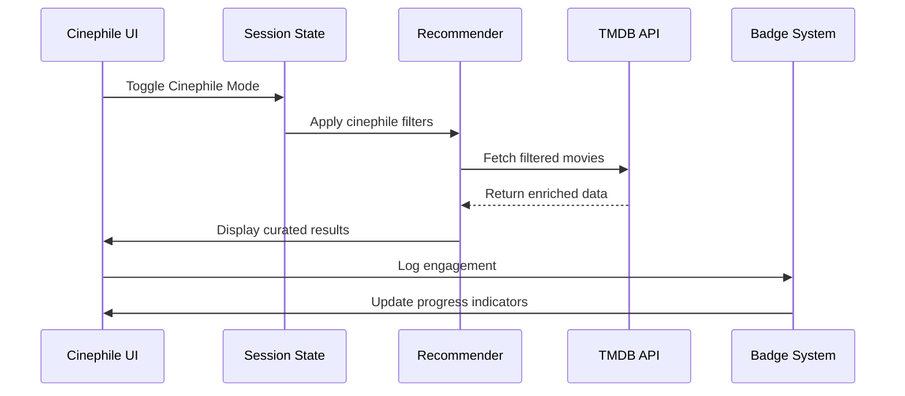

# MoviePulse v2.1 Architecture: Cinephile Mode

## Overview
Cinephile Mode is an advanced curation system that surfaces high-quality, niche films through specialized filtering and rewards user engagement with a badge-based achievement system.


## Core Components

### 1. Filtering System
**Location:** `streamlit_pages/page_07_cinephile_mode.py` + `ui_components/SidebarFilters.py`

**Logic:**
```python
if cinephile_mode_active:
    filters.update({
        'min_critic_score': 75,
        'include_criterion': True,
        'allow_foreign': True
    })
```

**Data Sources:**
- TMDB API (critic scores)
- `static_data/starter_packs.json` (Criterion Collection tags)

### 2. Badge System
**Location:** `session_utils/user_profile.py` + `ui_components/BadgeProgress.py`

**Badge Types:**
| Badge | Criteria | Data Source |
|-------|----------|-------------|
| 🎞️ Film Scholar | Watch 10 Criterion films | `starter_packs.json` |
| 🌎 World Cinema | Watch 5 foreign language films | TMDB `original_language` |
| 🔍 Deep Cuts | Rate 3 obscure films (>75% match) | User history + TMDB popularity |

### 3. Recommendation Pipeline
**Integration Points:**
1. User toggles Cinephile Mode
2. Filters propagate through `orchestrator.py`
3. Hybrid recommender prioritizes:
   - Critically acclaimed films (RT/MC scores)
   - Festival winners
   - Criterion Collection titles
   - Foreign language films

## Data Flow



## Design Decisions

1. **Progressive Disclosure**
   - Basic mode: Simple quality filters
   - Advanced: Director spotlights, thematic collections

2. **Performance Considerations**
   - Pre-cache Criterion Collection films
   - Local storage of badge progress

3. **Anti-Bias Measures**
   - Ensure geographic diversity
   - Balance decades representation
   - Gender parity in director selections

## Integration Map

| Component | Affected Files | Dependency Order |
|-----------|----------------|------------------|
| UI Layer | `page_07_cinephile_mode.py`, `BadgeProgress.py` | 1 |
| Business Logic | `user_profile.py`, `recommender/orchestrator.py` | 2 |
| Data Layer | `starter_packs.json`, `tmdb_client.py` | 3 |

## Future Extensions
1. **Social Features**
   - Cinephile leaderboards
   - Collection sharing

2. **Enhanced Discovery**
   - Director retrospectives
   - Film movement primers

3. **Educational Content**
   - Video essays
   - Shot analysis

This architecture maintains the app's core principles of being:
- Privacy-focused (no mandatory sign-in)
- Offline-capable (badges persist via localStorage)
- Performance-optimized (smart pre-caching)